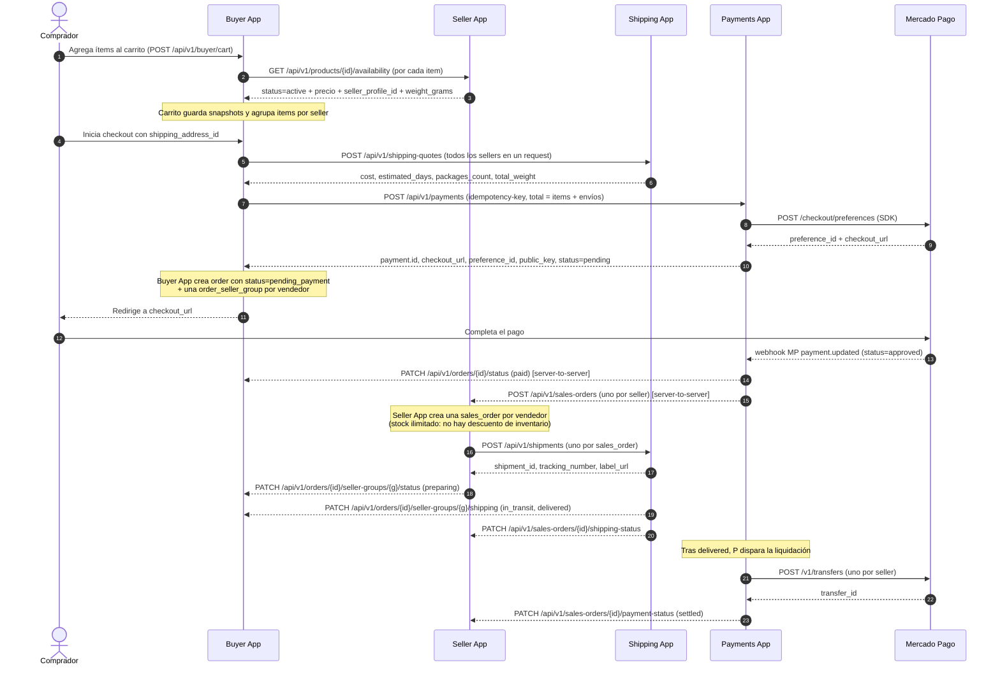
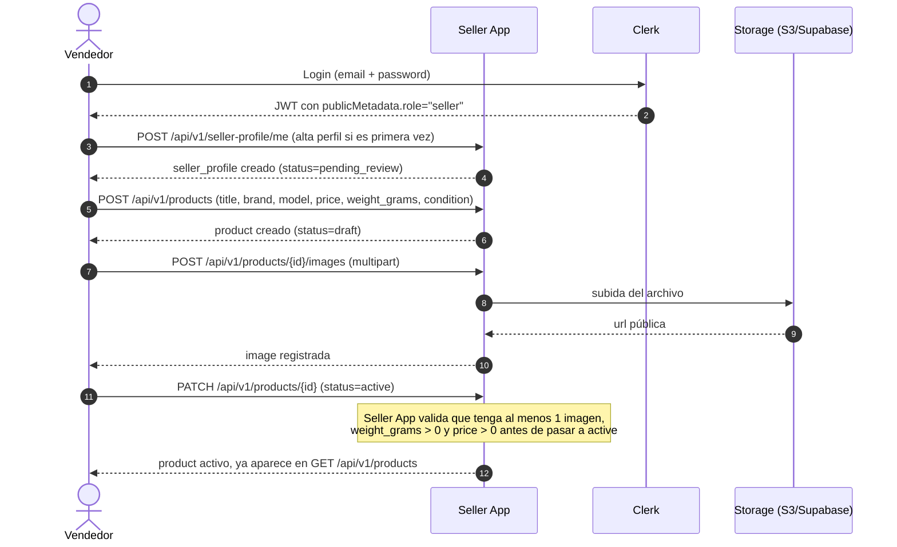
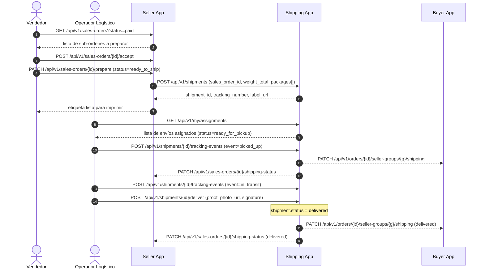
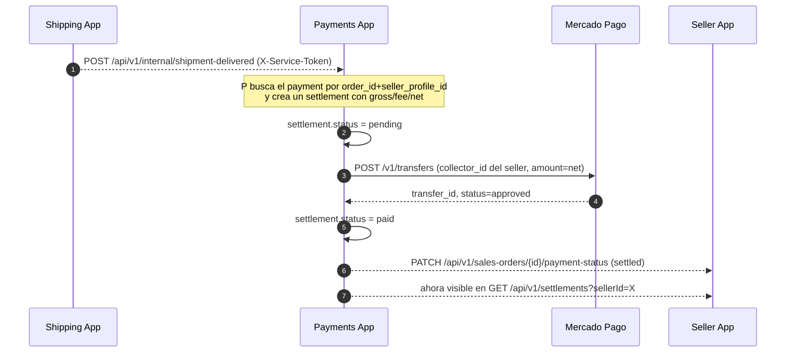
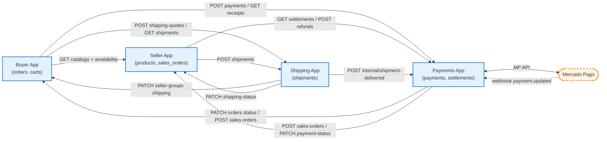

# 1.1 — Descripción del Sistema

> **Tipo C — Marketplace · BiciMarket**

---

## 1. Qué es BiciMarket

BiciMarket es un marketplace de bicicletas y repuestos que conecta **vendedores particulares y comerciales** con **compradores finales**. Cada operación atraviesa cuatro dominios independientes —compra, venta, envío y pago— y cada uno corre como una webapp aislada con su propia base de datos, su propio Clerk y su propia API. Las apps se comunican entre sí **siempre por REST sobre HTTP**: las consultas usan `GET`, las notificaciones de cambio de estado usan `POST` o `PATCH` server-to-server. Toda llamada inter-app va autenticada con un header `X-Service-Token` compartido entre el par origen↔destino.

El sistema se piensa para escalar a **órdenes multi-vendedor**: una compra puede contener productos de varios vendedores, y cada vendedor genera su propio paquete y su propia liquidación dentro de la misma orden del comprador.

### 1.1 Restricción del proyecto: stock ilimitado

> **Decisión de alcance académico**: para esta etapa el sistema **no maneja control de stock**. Toda publicación activa se considera con disponibilidad ilimitada. En consecuencia:
>
> - Los productos no llevan campo `stock`.
> - No existen `inventory_movements` ni endpoint de ajuste de inventario.
> - El carrito y el checkout nunca fallan por stock insuficiente; no existe el error `INSUFFICIENT_STOCK`.
> - Un vendedor puede rechazar una `sales_order` por otros motivos (producto dañado, error de publicación, etc.) pero no por "sin stock".
> - El endpoint `GET /products/{id}/availability` confirma únicamente que el producto está `active` y devuelve precio y peso, no cantidades.
>
> Si en una etapa futura se decide habilitar control de stock real, se reincorpora como módulo separado en Seller App sin tocar las demás apps.

## 2. Apps del sistema

| App          | Rol                                                                                  | Responsable   | Datos propios                                                                                          |
| ------------ | ------------------------------------------------------------------------------------ | ------------- | ------------------------------------------------------------------------------------------------------ |
| Buyer App    | Front comprador, dueña del carrito y de la `order`                                   | Camila Rojas  | Perfiles de comprador, direcciones, carrito, favoritos, órdenes, snapshot de items                     |
| Seller App   | Back vendedor, dueña del catálogo y de las `sales_orders` (sub-órdenes por vendedor) | Pierino Spina | Perfiles de vendedor, productos, imágenes, sub-órdenes de venta                                        |
| Shipping App | Logística, dueña de los `shipments`, paquetes y eventos de tracking                  | Enrique Seitz | Operadores logísticos, envíos, paquetes (con peso y dimensiones), cotizaciones, asignaciones, tracking |
| Payments App | Pasarela y liquidaciones, integra Mercado Pago                                       | Rocco Paoloni | Pagos, intentos, comprobantes, liquidaciones por vendedor, transferencias                              |

> **Importante**: todas las apps comparten **un único proyecto de Clerk** (el del Buyer App). Los usuarios tienen una sola cuenta de Clerk; su rol en cada app se determina por `publicMetadata`. Las apps se hablan entre sí por REST con `X-Service-Token`. Ver `05-usuarios.md`.

## 3. Actores

| Actor              | Apps donde se loguea                                   | Rol en Clerk                                      |
| ------------------ | ------------------------------------------------------ | ------------------------------------------------- |
| Comprador          | Buyer App                                              | `publicMetadata.role = "buyer"`                   |
| Vendedor           | Seller App                                             | `publicMetadata.role = "seller"`                  |
| Operador logístico | Shipping App                                           | `publicMetadata.role = "logistics"`               |
| Admin de Payments  | Payments App (admin UI: refunds, payouts, settlements) | `publicMetadata.admin = true` (obligatorio)       |
| Admin transversal  | Las apps donde necesite operar                         | `publicMetadata.admin = true`                     |

Un humano que opera en varias apps usa **la misma cuenta de Clerk**. Un usuario puede tener múltiples roles activos simultáneamente (ej.: comprador y vendedor). Si querés ver tus comprobantes vas a Buyer App; si querés ver tus liquidaciones vas a Seller App. Esas vistas las renderizan las apps fuente consumiendo Payments por REST.

## 4. Flujos principales

Esta sección describe los flujos críticos con diagramas de carril (swim lanes). Cada carril es una app distinta y cada flecha cruza un contrato de la API documentado en `03-apis.md`.

Convenciones del diagrama:

- Línea sólida (`->>`): REST request/response **iniciado por el comprador o vendedor** (UI → backend propio).
- Línea punteada (`-->>`): REST server-to-server entre apps (`X-Service-Token`). Sigue siendo HTTP normal — la única diferencia con la línea sólida es que la dispara un servidor, no la UI.
- `note` sobre un carril: trabajo interno (DB, validaciones, llamadas a Mercado Pago).

---

### 4.1 Flujo de compra (multi-vendedor con cálculo de envío)

Caso: el comprador tiene en el carrito 1 bici del vendedor A y 2 cubiertas del vendedor B. Debe recibir un único checkout, dos sub-órdenes en Seller App, dos paquetes en Shipping App y dos liquidaciones en Payments App.

#### Reglas de este flujo

1. **`order_id` es soberanía de Buyer App.** Todas las demás apps guardan `order_id` como referencia opaca y nunca como FK a una tabla local.
2. **Una `order` se descompone en N `order_seller_groups`**, uno por vendedor. Cada grupo tiene su propia dirección de retiro, su propio paquete y su propio shipping cost.
3. **El total de la orden** = Σ `unit_price * qty` por item + Σ `shipping_cost` por grupo. Se calcula en Buyer App **antes** de llamar a Payments.
4. **No hay descuento de stock**. Por restricción del proyecto el stock es ilimitado, así que el carrito y el checkout nunca se bloquean por disponibilidad. `availability` solo confirma que el producto sigue `active` y devuelve precio y peso vigentes.
5. **La liquidación al vendedor se dispara por entrega confirmada** (`delivered`), no por pago aprobado. Esto protege contra disputas previas a la entrega.

---

### 4.2 Flujo de publicación de producto

Caso: un vendedor crea una nueva publicación de bicicleta usada con tres fotos.

#### Reglas

- `weight_grams` y `dimensions_cm` son **obligatorios** para activar la publicación; sin esos datos Shipping App no puede cotizar.
- `status=active` solo se permite con perfil de vendedor `verified`; antes queda en `draft`.
- Buyer App consume el catálogo público vía `GET /api/v1/products?…` con paginación, filtros y orden.

---

### 4.3 Flujo de despacho y entrega (sub-orden por vendedor)

Caso: un vendedor recibió una `sales_order` ya pagada y arma el paquete. Un operador logístico la retira y la entrega.

#### Reglas

- El operador logístico **no ve datos de pago**. Solo dirección, tracking, peso y bultos.
- El `delivery_proof` (foto + nota; firma opcional) es obligatorio para pasar a `delivered`.
- Una vez `delivered`, Shipping le manda un `PATCH` a Buyer y a Seller, y un `POST /api/v1/internal/shipment-delivered` a Payments para disparar la transferencia al vendedor. Las tres son llamadas REST normales con `X-Service-Token`.

> **ADR-006 — tracking global del pedido**: en órdenes multi-vendedor, los N shipments se agrupan en un `shipment_group` (1 por `order_id`). El comprador ve un tracking GLOBAL (`BMK-…`) del grupo; cada vendedor ve solo su tracking INDIVIDUAL (`TRK-AR-…`). Para single-vendor el grupo sigue existiendo pero global e individual apuntan al mismo pedido. Ver `04-modelo-de-datos.md §3.1` y `06-estados-y-diagramas.md §4`.

---

### 4.4 Flujo de liquidación al vendedor

Caso: tras la entrega de una `sales_order`, el dinero retenido por Payments se libera al vendedor descontando una comisión del marketplace.

#### Reglas

- Un `payment` se descompone en N `settlements`, uno por vendedor. Misma lógica que `order → order_seller_groups`.
- La comisión (`fee_amount`) se calcula como porcentaje configurable por marketplace (default 10%) sobre el `gross_amount` del vendedor.
- Si la transferencia falla, `settlement.status = failed` y se reintenta hasta 3 veces con backoff exponencial; tras eso pasa a `manual_review`.

---

## 5. Mapa de comunicación entre apps

Todas las flechas entre nuestras apps son **llamadas REST sobre HTTP** usando los verbos clásicos `GET`, `POST`, `PUT`, `PATCH`, `DELETE`. La autenticación cambia según quién la dispara:

- Cuando la dispara la UI propia de la app: `Authorization: Bearer <JWT-de-Clerk>` (mismo Clerk compartido).
- Cuando la dispara el backend de una app contra otra (consultas o notificaciones): `X-Service-Token: <secret-del-par>`.

La única excepción —porque no podemos cambiarla— es el **webhook de Mercado Pago → Payments** (`POST /webhooks/mercadopago`). Ese sí es un webhook clásico porque MP es externo y notifica así por diseño; Payments valida la firma con `MERCADOPAGO_WEBHOOK_SECRET`. Es el único webhook del sistema.

| App          | Rol                                                               | Responsable     | Datos propios                                                                                       |
|--------------|-------------------------------------------------------------------|-----------------|-----------------------------------------------------------------------------------------------------|
| Buyer App    | Front comprador, dueña del carrito y de la `order`               | Camila Rojas    | Perfiles de comprador, direcciones, carrito, favoritos, órdenes, snapshot de items                 |
| Seller App   | Back vendedor, dueña del catálogo y de las `sales_orders`        | Pierino Spina   | Perfiles de vendedor, productos, imágenes, sub-órdenes de venta                                    |
| Shipping App | Logística, dueña de los `shipments`, paquetes y tracking         | Enrique Seitz   | Operadores logísticos, envíos, paquetes (peso y dimensiones), cotizaciones, asignaciones, tracking |
| Payments App | Pasarela y liquidaciones, integra Mercado Pago                   | Rocco Paoloni   | Pagos, intentos, comprobantes, liquidaciones por vendedor, transferencias                          |

> **Importante**: todas las apps comparten **un único proyecto de Clerk** (el del Buyer App). Los usuarios tienen una sola cuenta de Clerk; su rol en cada app se determina por `publicMetadata`. Las apps se hablan entre sí por REST con `X-Service-Token`. Ver `05-usuarios.md`.

## 6. Estados clave

Las máquinas de estado completas viven en `06-estados.md`. Versión corta:

- **`order.status`** (Buyer): `pending_payment → paid → partially_shipped → shipped → delivered → completed`. Caminos alternativos: `cancelled`, `refunded`.
- **`order_seller_group.status`** (Buyer): `pending → preparing → ready_to_ship → in_transit → delivered → settled`.
- **`sales_order.fulfillment_status`** (Seller): `pending → accepted → preparing → ready_to_ship → handed_over → delivered`.
- **`shipment.status`** (Shipping): `created → ready_for_pickup → picked_up → in_transit → out_for_delivery → delivered → returned`.
- **`payment.status`** (Payments): `pending → approved → rejected → refunded`. Estados terminales no se reabren.
- **`settlement.status`** (Payments): `pending → paid → failed → manual_review`.

---

## Apéndice: Cambios consolidados

### A. Clerk: de 4 proyectos a 1 compartido

Este es el cambio más significativo de la documentación. Originalmente se describían 4 Clerks independientes; actualmente hay un único proyecto de Clerk compartido.

| Aspecto | Documentación anterior | Documentación actual |
|---|---|---|
| Proyectos de Clerk | 4 (uno por app) | 1 compartido |
| Identidad de usuario | N cuentas separadas (una por app) | 1 sola cuenta en todas las apps |
| Determinación del rol | Implícita por el Clerk de la app | Explícita vía `publicMetadata.role` |
| Admin transversal | Necesitaba cuentas en cada Clerk | Una cuenta con `publicMetadata.admin=true` |

### B. Flujo de liquidación (§4.4) — Payments App

| Aspecto | Anterior | Actual | Por qué |
|---------|----------|--------|---------|
| Transferencia MP | `P->>MP: POST /v1/transfers` → `MP-->>P: transfer_id` | **No implementado**. Payments no llama a `POST /v1/transfers`. El settlement queda `pending` y admin lo marca como pagado manualmente. | Las transfers de MP requieren `collector_id` de cada seller y no están en el alcance académico. Se reemplazó por acción admin: `PATCH /api/v1/settlements` marca settlements como `paid`. |
| Settlement | Se crea automáticamente con transfer | Se crea al recibir `shipment-delivered` desde Shipping, queda `pending` | La liquidación se gatilla por entrega, no por pago. Como no hay transfer automática, el admin debe marcarla manualmente. |
| Notificación Seller | `P-->>S: PATCH /api/v1/sales-orders/{id}/payment-status (settled)` | Comentada | Notificaciones inter-app deshabilitadas. |

### C. §3 (Actores) — cambio en la tabla

- **Anterior**: la tabla de actores listaba el Clerk específico que usaba cada actor (`Clerk-Buyer`, `Clerk-Seller`, etc.) como columna.
- **Actual**: la tabla lista el valor de `publicMetadata` que distingue cada rol, sin columna de Clerk separado.

### D. §5 (Mapa de comunicación) — nota al pie

- **Anterior**: la nota al pie del mapa repetía que cada app tenía su propio Clerk.
- **Actual**: la nota al pie establece que todas las apps comparten el mismo proyecto de Clerk.
