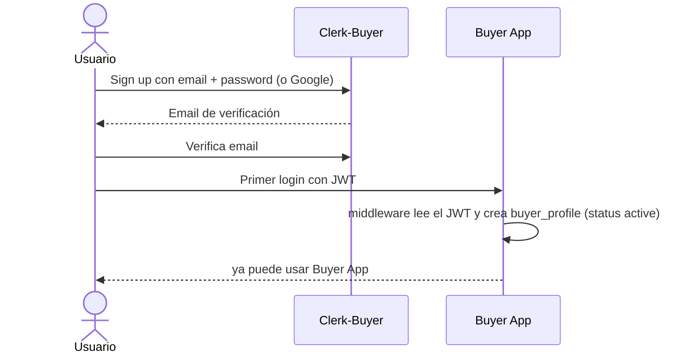
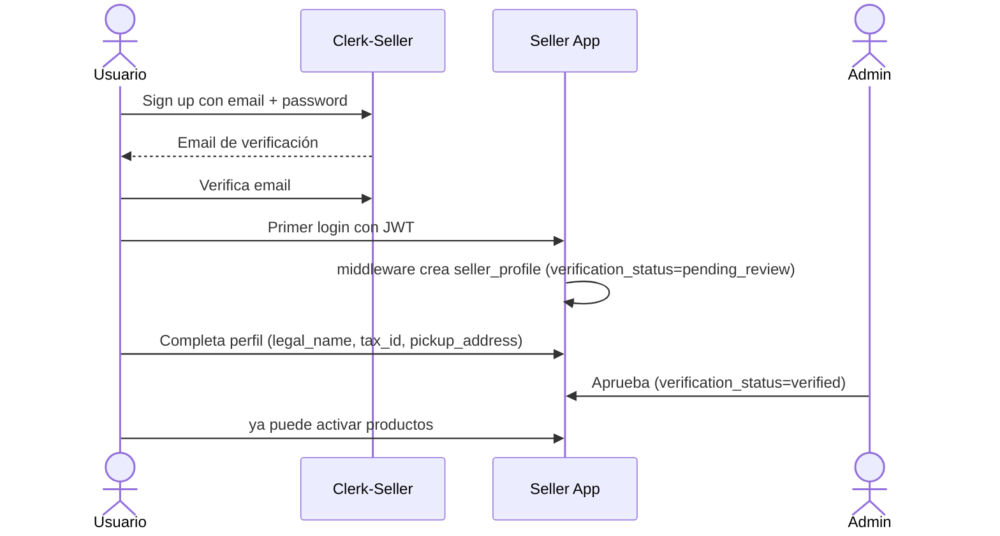
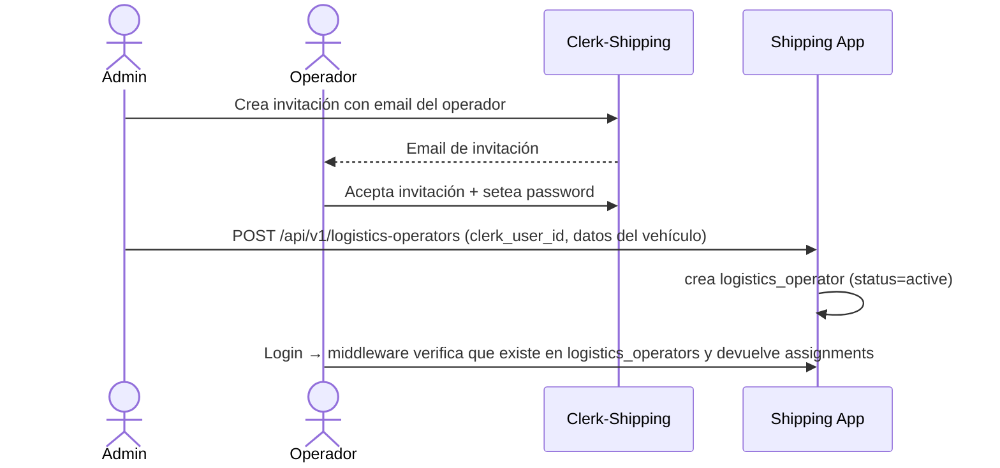
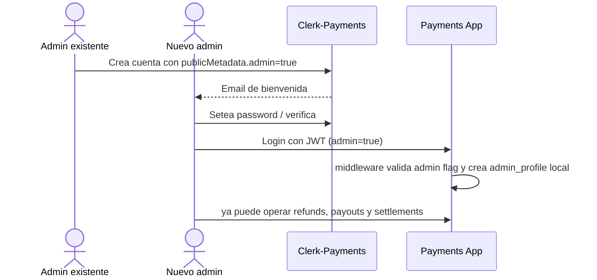

# 1.5 — Usuarios

> **Tipo C — Marketplace · BiciMarket**

---

## 1. Clerk compartido

Todas las apps del sistema usan **el mismo proyecto de Clerk** (el del Buyer App). Las claves `CLERK_PUBLISHABLE_KEY` y `CLERK_SECRET_KEY` son las mismas en los cuatro repos.

| App | Rol funcional | Quién se registra | Cómo se determina el rol |
|---|---|---|---|
| Buyer App | `buyer` | Cualquiera que quiera comprar | `publicMetadata.role = "buyer"` |
| Seller App | `seller` | Vendedores aprobados (admin pasa de `pending_review` a `verified`) | `publicMetadata.role = "seller"` |
| Shipping App | `logistics` | Operadores logísticos invitados por admin | `publicMetadata.role = "logistics"` |
| Payments App | `admin` (obligatorio) | **Solo admins del marketplace** (refunds manuales, payouts, settlements). | `publicMetadata.admin = true` |

> Un usuario tiene **una sola cuenta de Clerk** y puede tener múltiples roles activos simultáneamente (ej.: comprador y vendedor). Las apps validan el rol correspondiente vía `publicMetadata` al recibir cada request.

---

## 2. Asignación de rol `admin`

`admin` es un rol transversal. Como todas las apps comparten el mismo Clerk, un usuario admin tiene **una sola cuenta** con `publicMetadata.admin = true` y puede operar en cualquier app que requiera privilegios de administrador.

| App | Cómo aplica el flag admin | Endpoint donde aplica |
|---|---|---|
| Buyer App | `publicMetadata.admin = true` | Acceso a `GET /admin/orders`, etc. |
| Seller App | `publicMetadata.admin = true` | Endpoints admin (verificaciones de vendedores, etc.). |
| Shipping App | `publicMetadata.admin = true` | Reasignaciones, cambio manual de status, alta de operadores. |
| Payments App | **Obligatorio**: la app rechaza JWT sin `publicMetadata.admin = true`. | Refunds manuales, payouts manuales, cierre de settlements. |

Promoción a admin: la hace un admin existente vía Clerk Dashboard. Sin self-service.

---

## 3. Sincronización Clerk → DB local (provisioning perezoso, sin webhooks)

> **Decisión del proyecto**: no usamos webhooks de Clerk. Cada app sincroniza su perfil local **al momento del login**, leyendo el JWT validado y haciendo upsert en su DB. Es un trade-off conocido: los cambios hechos en Clerk Dashboard solo se reflejan cuando el usuario vuelve a loguearse, pero a cambio nos ahorramos un endpoint público con firma y todo el manejo de retry.

### 3.1 Cómo funciona

En el middleware de auth de cada app, antes de pasarle el request al controller:

1. Validar el JWT de Clerk → obtener `clerk_user_id`, `email`, `full_name`.
2. Buscar el perfil local por `clerk_user_id`.
3. Si no existe → crear (con los defaults que correspondan a la app).
4. Si existe pero `email` o `full_name` cambiaron respecto del JWT → actualizar el snapshot.
5. Continuar con el request normal.

Esto se hace en cada request, pero el costo es despreciable porque solo es un `SELECT` por `clerk_user_id` (índice único). Solo escribe cuando hay cambios reales.

### 3.2 Defaults al crear perfil

| App | Acción al primer login |
|---|---|
| Buyer | crea `buyer_profile` con `clerk_user_id`, `email`, `full_name`. Entra directo (no aplica `verification_status`). |
| Seller | crea `seller_profile` con `verification_status=pending_review`. No puede activar productos hasta que un admin lo apruebe. |
| Shipping | **no crea automáticamente**. Si el `clerk_user_id` no figura en `logistics_operators`, devuelve 403. Los operadores se crean por admin con `POST /api/v1/logistics-operators`. |
| Payments | crea `admin_profile` local en su DB **solo si** el JWT trae `publicMetadata.admin=true`. Sin flag admin, devuelve 403 y no crea nada. |

### 3.3 Soft delete

Cuando se borra una cuenta en Clerk, no nos enteramos automáticamente. Si hace falta, el admin elimina el perfil local manualmente, o se puede correr un cron diario que pregunte a la API de Clerk por `clerk_user_id`s que ya no existen y los soft-deletea. Para Etapa 1 basta con la limpieza manual.

---

## 4. Claims del JWT por app

Todas las apps validan el JWT contra el mismo Clerk. Los claims requeridos varían por app según el rol esperado.

| App | Claims requeridos | Validación adicional |
|---|---|---|
| Buyer | `sub` (clerk_user_id), `email`, `email_verified=true`, `publicMetadata.role="buyer"` | El `buyer_profile` se crea automáticamente en el primer login. |
| Seller | mismos + `publicMetadata.role="seller"` | El `seller_profile` asociado debe estar `verified` (chequeo en backend). |
| Shipping | mismos + `publicMetadata.role="logistics"` | El `logistics_operator` asociado debe estar `active`. |
| Payments | mismos + `publicMetadata.admin=true` | Sin flag admin, 401. No hay endpoints públicos para buyers/sellers en Payments. |

Operaciones `admin` en cualquier app requieren además `publicMetadata.admin === true`.

---

## 5. Estrategia de roles

### 5.1 Reglas

1. **El rol funcional se determina por `publicMetadata`**. Un usuario puede tener múltiples roles activos; cada app verifica el rol que le corresponde en cada request.
2. **Un humano = una cuenta de Clerk** para todas las apps del sistema.
3. **`admin` es transversal** y vive en `publicMetadata.admin = true`. En Payments App es obligatorio; en las demás es opcional y habilita endpoints de administración.
4. **El alta de seller no es libre**: el `seller_profile` se crea como `pending_review` y solo un admin lo pasa a `verified`. Hasta entonces, no puede activar productos.
5. **El alta de operador logístico tampoco es libre**: requiere invitación de un admin.
6. **Buyers y sellers no se loguean en Payments App.** Para ver comprobantes entran a Buyer App; para ver liquidaciones entran a Seller App. Esas apps consumen los datos de Payments por REST con `X-Service-Token`.

### 5.2 Flujo de alta — Comprador



### 5.3 Flujo de alta — Vendedor



### 5.4 Flujo de alta — Operador logístico



### 5.5 Flujo de alta — Admin de Payments



---

## 6. Variables de entorno por app

Todas las apps usan las **mismas** claves de Clerk (las del Buyer App):

```env
# Clerk compartido — mismos valores en los cuatro repos
CLERK_PUBLISHABLE_KEY=pk_live_…
CLERK_SECRET_KEY=sk_live_…
```

Las claves `CLERK_PUBLISHABLE_KEY` y `CLERK_SECRET_KEY` son idénticas en Buyer, Seller, Shipping y Payments App.

---

## Apéndice: Diferencias con documentacion-vieja

La documentación vieja describía un sistema con **4 Clerks independientes**; la actual describe un **único Clerk compartido**.

### 1. Título y concepto central

- **Vieja**: §1 se llamaba "Mapa de Clerks" y describía 4 proyectos de Clerk distintos (`buyer.bicimarket`, `seller.bicimarket`, `shipping.bicimarket`, `payments.bicimarket`), cada uno con su propio `audience` y `issuer`.
- **Actual**: §1 se llama "Clerk compartido" y describe un único proyecto con roles diferenciados por `publicMetadata`.

**Por qué**: gestionar 4 proyectos Clerk independientes para un sistema académico no aportaba valor. Implicaba 4 sets de claves que rotar, imposibilidad de que un usuario fuera comprador y vendedor con la misma cuenta, y que el rol admin requiriera cuentas separadas en cada Clerk. El Clerk unificado elimina toda esa fricción.

### 2. Identidad del usuario

| Aspecto | documentacion-vieja | documentacion actual |
|---|---|---|
| Cuentas por humano | N cuentas (una por app) | 1 sola cuenta |
| Rol funcional | Implícito por el Clerk de la app | Explícito vía `publicMetadata.role` |
| Correlación entre apps | Inexistente (cuentas aisladas) | Misma cuenta y `clerk_user_id` en todas |

### 3. Rol `admin`

- **Vieja**: un admin necesitaba **cuentas separadas en cada Clerk** donde quisiera operar, con `publicMetadata.admin=true` en cada una. Tenía que gestionar 4 contraseñas y 4 procesos de alta.
- **Actual**: una sola cuenta con `publicMetadata.admin=true` vale para todas las apps simultáneamente.

**Por qué**: con un Clerk compartido el admin tiene una sola identidad, lo que simplifica el onboarding y la revocación de privilegios.

### 4. Claims JWT y validación

- **Vieja**: cada app validaba el `iss` (issuer) y `aud` (audience) de **su propio Clerk**. Un JWT de Clerk-Seller era rechazado por Buyer App porque el issuer no coincidía.
- **Actual**: todas las apps validan el mismo JWT emitido por el mismo Clerk. El control de acceso lo hace `publicMetadata.role`, no el issuer.

### 5. Variables de entorno

- **Vieja**: cada app tenía sus propias `CLERK_PUBLISHABLE_KEY`, `CLERK_SECRET_KEY`, `CLERK_ISSUER` y `CLERK_AUDIENCE`, todas distintas.
- **Actual**: las cuatro apps comparten exactamente las mismas `CLERK_PUBLISHABLE_KEY` y `CLERK_SECRET_KEY` (las del Buyer App). No existen `CLERK_ISSUER` ni `CLERK_AUDIENCE` por separado.

### 6. Lo que NO cambió

Las secciones §3 (sincronización perezosa sin webhooks), §3.2 (defaults al crear perfil), §3.3 (soft delete), y los diagramas de flujo de alta (§§5.2–5.5) son **idénticos** en ambas versiones. La mecánica de provisioning local sigue siendo la misma; lo que cambió es que ahora el JWT viene siempre del mismo Clerk.
